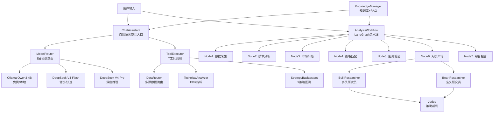

# AI+金融量化分析智能体 — 架构设计文档

> 第八届全球校园人工智能算法精英大赛 · AI智能体开发应用赛
>
> 选题方向: **AI+商科 → AI+金融**
>
> 版本: v3.0-competition

---

## 一、需求分析

### 1.1 业务背景

A股市场拥有5000+上市公司,个人投资者面临严重的信息过载。传统分析方法依赖人工阅读财报、盯盘、画线,效率低下且易受情绪影响。AI智能体可以通过自动化数据处理、多维度分析、对抗性辩论等手段,为投资者提供系统化的量化决策支持。

### 1.2 目标用户

| 用户类型 | 核心需求 | 使用场景 |
|---------|---------|---------|
| 个人投资者 | 选股决策、风险评估 | 每日盘后查看市场概况和个股评分 |
| 量化研究员 | 策略回测、因子挖掘 | 验证新策略的历史表现 |
| 投资顾问 | 报告生成、客户沟通 | 快速生成个股/行业分析报告 |

### 1.3 核心功能

1. **市场状态检测** — 6种市场体制自动识别 (强牛/弱牛/震荡/弱熊/强熊/危机)
2. **全市场扫描** — 5000+股票4维评分排序 (技术面40% + 资金流25% + 动量20% + 质量15%)
3. **个股深度分析** — 130+技术指标 + 多空辩论 + 策略回测
4. **量化信号生成** — 6级信号 (STRONG_BUY→STRONG_SELL) + 置信度 + 8层风控
5. **自然语言交互** — 7工具调用 + 知识库RAG检索

---

## 二、智能体架构总览

### 2.1 Multi-Agent协作架构



### 2.2 Agent角色定义

| Agent | 角色 | 输入 | 输出 | 模型 |
|-------|------|------|------|------|
| **ChatAssistant** | 对话入口 | 自然语言 | 自然语言回复 | Flash/Pro |
| **TechnicalAnalyst** | 技术分析 | K线数据 | 6维分析报告 | Flash |
| **MarketScanner** | 市场扫描 | 5000+股票池 | Top-N评分榜 | Flash |
| **BullResearcher** | 多头研究 | 量化数据 | 看涨论据+确信度 | Pro |
| **BearResearcher** | 空头研究 | 量化数据 | 看跌论据+确信度 | Pro |
| **Judge** | 策略裁判 | 多空论据 | 结构化JSON裁决 | Pro |
| **RiskAssessor** | 风控评估 | 持仓+信号 | 8层风控检查 | Flash |

---

## 三、业务流程设计

### 3.1 完整分析流水线

```
用户输入股票代码
    │
    ▼
┌─────────────────────────────────────────────────┐
│  Step 1: 数据采集 (Data Preparation)              │
│  - 从4个数据源获取K线 (Baostock/Tencent/EastMoney/AKShare) │
│  - 检测市场体制 (6状态分类)                       │
│  - 采集北向资金、板块轮动等另类数据                │
└────────────┬────────────────────────────────────┘
             ▼
┌─────────────────────────────────────────────────┐
│  Step 2: 技术分析 (Technical Analysis)            │
│  - 计算130+指标 (趋势/动量/波动/量/形态/统计)       │
│  - LLM解读指标组合含义                             │
│  - Code-as-Reasoning: 代码计算→数字锁定→叙事      │
└────────────┬────────────────────────────────────┘
             ▼
┌─────────────────────────────────────────────────┐
│  Step 3: 市场扫描 (Market Scanner)                │
│  - 4维评分: 技术面(40%)+资金流(25%)+动量(20%)+质量(15%) │
│  - 自动过滤ST/新股/僵尸股                         │
└────────────┬────────────────────────────────────┘
             ▼
┌─────────────────────────────────────────────────┐
│  Step 4: 策略匹配 (Strategy Matching)             │
│  - 根据市场体制匹配8种策略                         │
│  - 计算fit_score (体制适配度+趋势对齐度)          │
│  - 筛选Top-3策略                                  │
└────────────┬────────────────────────────────────┘
             ▼
┌─────────────────────────────────────────────────┐
│  Step 5: 回测验证 (Backtest Verification)         │
│  - 事件驱动回测 (T+1/涨跌停/停牌模拟)             │
│  - 6层过拟合守卫                                  │
│  - 输出: 胜率/夏普/最大回撤/盈亏比                │
└────────────┬────────────────────────────────────┘
             ▼
┌─────────────────────────────────────────────────┐
│  Step 6: 对抗辩论 (Adversarial Debate)            │
│  - Bull Researcher → 看涨论据+确信度              │
│  - Bear Researcher → 看跌论据+确信度              │
│  - Judge → 综合裁决 JSON{action, conviction, ...} │
│  - 双方基于同一份量化数据 (防止LLM幻觉)            │
└────────────┬────────────────────────────────────┘
             ▼
┌─────────────────────────────────────────────────┐
│  Step 7: 综合报告 (Synthesis)                     │
│  - 市场概况 + 个股分析 + 交易建议 + 风险提示      │
│  - 结构化Markdown格式                             │
│  - NumericSafetyChecker校验所有数字               │
└─────────────────────────────────────────────────┘
```

### 3.2 风控体系 (8层)

```
L1: 回撤熔断 → 单日-8%减仓50%, -15%清仓
L2: ATR动态止损 → 2x ATR硬止损
L3: 移动止盈 → 从最高点回落6%止盈
L4: 仓位限制 → 单票≤25%, 行业≤35%
L5: 踩踏防护 → 跌停板无法卖出时次日竞价挂单
L6: 持仓天数 → 超过20交易日强制评估
L7: 跌停检测 → 触及跌停立即评估
L8: 相关性监控 → 持仓组合相关性>0.8时预警
```

---

## 四、知识库架构

### 4.1 三层知识体系

```
┌─────────────────────────────────────────┐
│  Layer 1: 结构化规则 (YAML)               │
│  - trading_rules.yaml  交易规则          │
│  - indicator_guide.yaml  指标手册        │
│  - strategy_registry.yaml  策略注册表    │
│  - hardened_definitions.yaml  信号定义   │
├─────────────────────────────────────────┤
│  Layer 2: 参考文档 (Markdown)             │
│  - glossary.md  术语表 (~45术语)         │
│  - market_cycle.md  市场周期 (7轮牛熊)    │
│  - fundamental_analysis.md  基本面阈值    │
│  - competition_rules.md  竞赛场景约束    │
├─────────────────────────────────────────┤
│  Layer 3: 向量检索 (ChromaDB)             │
│  - K线形态相似度检索                     │
│  - RAG语义检索 (关键词fallback)           │
│  - 历史相似场景匹配                       │
└─────────────────────────────────────────┘
```

### 4.2 提示词体系

```
knowledge/prompts/
├── system/          # 系统级提示词 (Agent角色定义)
│   ├── chat_assistant.txt
│   ├── technical_analyst.txt
│   ├── market_scanner.txt
│   ├── bull_researcher.txt
│   ├── bear_researcher.txt
│   ├── judge.txt
│   ├── synthesis.txt
│   └── risk_assessor.txt
├── tasks/           # 任务级提示词 (场景化指令)
│   ├── competition_demo.txt
│   ├── risk_alert.txt
│   ├── sector_rotation.txt
│   └── signal_review.txt
└── few_shots/       # Few-shot样例
    ├── signal_review.json
    ├── panic_sell.json
    ├── sector_rotation.json
    └── stop_loss_execution.json
```

---

## 五、技术实现

### 5.1 技术栈

| 层级 | 技术 | 用途 |
|------|------|------|
| LLM | DeepSeek V4 (Flash+Pro) + Ollama Qwen3-4B | 3层成本优化模型路由 |
| Agent框架 | LangGraph + Function Calling | 工作流编排+工具调用 |
| 数据处理 | AKShare / Baostock / EastMoney / Tencent | 多源A股数据 |
| 技术指标 | TA-Lib + pandas-ta | 130+技术指标计算 |
| 回测引擎 | 自研事件驱动引擎 | 真实A股约束模拟 |
| 向量数据库 | ChromaDB | K线形态相似度检索 |
| 知识库 | YAML + Markdown + ChromaDB | 三层知识体系 |
| 前端 | Streamlit + FastAPI + Plotly | Dashboard + API |
| 深度学习 | PyTorch + Transformers | 本地模型推理 |

### 5.2 模型路由策略

```
                    ┌─────────────┐
                    │  任务复杂度  │
                    └──────┬──────┘
                           │
           ┌───────────────┼───────────────┐
           ▼               ▼               ▼
       简单任务         中等任务         复杂任务
    (indicator_read  (technical_     (adversarial_
     simple_qa       analysis       debate
     data_format)    strategy_match) synthesis)
           │               │               │
           ▼               ▼               ▼
    ┌──────────┐   ┌──────────┐   ┌──────────┐
    │  LOCAL   │   │  FLASH   │   │   PRO    │
    │ Qwen3-4B │   │ DS V4-F  │   │ DS V4-R  │
    │  免费    │   │  ¥1-2/M  │   │  ¥3-6/M  │
    └──────────┘   └──────────┘   └──────────┘
    (60%负载)      (30%负载)      (10%负载)
```

**降级策略**: 高峰时段自动降级 (PRO→Flash, Flash→Local) + 预算超90%强制Local

---

## 六、输出结果设计

### 6.1 交易信号格式

```json
{
  "symbol": "sh.600519",
  "name": "贵州茅台",
  "signal": "BUY",
  "confidence": 0.72,
  "score": 7.5,
  "entry_price": 1680.00,
  "stop_loss": 1620.00,
  "take_profit": 1780.00,
  "key_reasons": [
    "MACD金叉+放量突破",
    "北向资金连续3日净流入",
    "RSI从超卖区反弹"
  ],
  "risks": [
    "大盘处于弱熊格局",
    "白酒板块轮动进入退潮期"
  ],
  "backtest_support": {
    "strategy": "macd_trend",
    "win_rate": 0.58,
    "sharpe": 1.32,
    "max_drawdown": -0.12
  }
}
```

### 6.2 日报格式

```markdown
# A股量化日报 — 2026-07-28

## 市场概况
- 上证指数: 3,250.50 (+0.32%)
- 市场体制: weak_bull (置信度 0.68)
- 北向资金: 净流入 12.5亿

## 今日关注
| 股票 | 评分 | 信号 | 策略 | 回测胜率 |
|------|------|------|------|---------|
| 600519 贵州茅台 | 7.5 | BUY | MACD趋势 | 58% |
| 000858 五粮液 | 6.8 | WATCH | 布林反转 | 55% |

## ⚠️ 风险提示
历史数据不代表未来表现。本文仅为量化分析参考，不构成投资建议。
```
